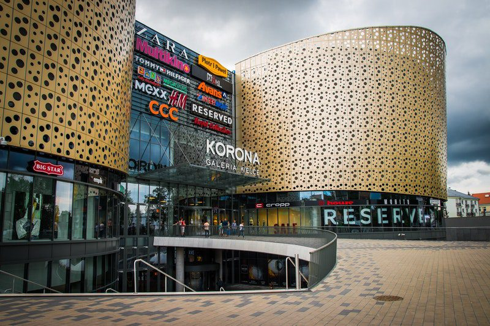
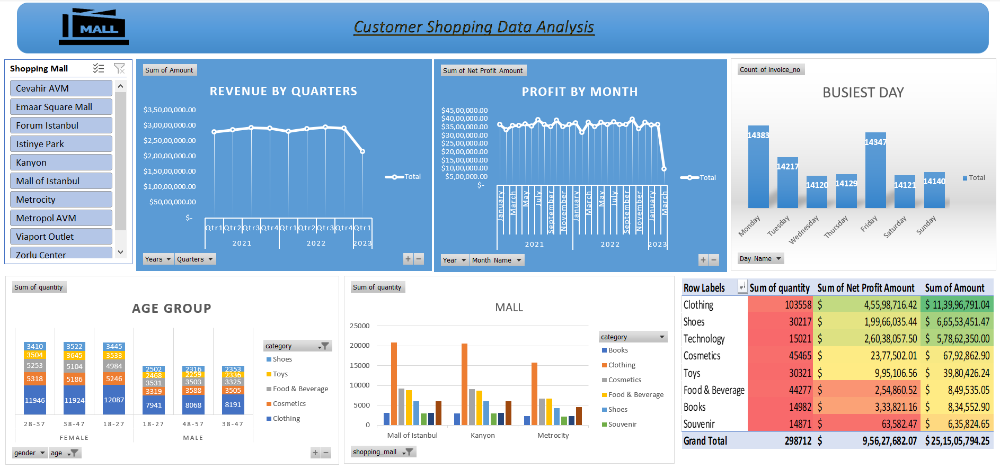

# Customer_Shopping_Data_Analysis
&nbsp;

## Overview : 
This dashboard is for presenting my insight to the regional manager of the Shopping Mall chain with 10 different malls. I have created a dashboard which can help me discuss the sales of these malls with my higher-ups. This will be done solely to increase the sales.

## Tool used :
Microsoft Excel

## Result and Insights :
- I have noticed that the revenue starts increasing from 1st Quarter and there is a slight decrease in 4th Quarter.
- There is a increase in Profit By Month For January, July and October each year also there is decrease in profit for Febuary, September and November each year.
- The busiest days are Mondays, Tuesdays, Fridays and Sundays. There are also some exceptions like Metropol AVM Mall where Wednesdays, Thursdays Fridays are most busient days.

## Data Story :

## Dashboard :
&nbsp;
